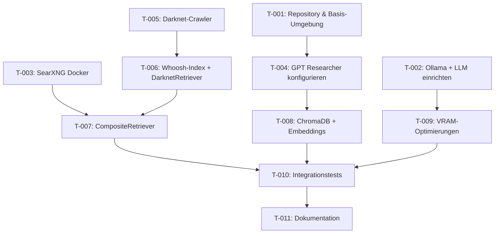

# Abhängigkeitsgraph

## Metadaten
- **Erstellt:** 2026-05-16

## Task-Abhängigkeiten (DAG)



## Ausführungsreihenfolge (Topologisch sortiert)

### Welle 1 (keine Abhängigkeiten) – parallel
- **T-001:** Repository & Basis-Umgebung
- **T-002:** Ollama + LLM einrichten
- **T-003:** SearXNG Docker
- **T-005:** Darknet-Crawler

### Welle 2
- **T-004:** GPT Researcher konfigurieren (nach T-001)
- **T-006:** Whoosh-Index + DarknetRetriever (nach T-005)
- **T-009:** VRAM-Optimierungen (nach T-002)

### Welle 3
- **T-007:** CompositeRetriever (nach T-003, T-006)
- **T-008:** ChromaDB + Embeddings (nach T-004)

### Welle 4
- **T-010:** Integrationstests (nach T-007, T-008, T-009)

### Welle 5
- **T-011:** Dokumentation (nach T-010)

## Kritischer Pfad
```
T-005 → T-006 → T-007 → T-010 → T-011
```
Geschätzte Dauer: 2×medium + 1×medium + 1×medium + 1×small ≈ **18 h**

## Externe Abhängigkeiten

| Komponente | Typ | Verfügbarkeit | Risiko |
|---|---|---|---|
| GPT Researcher (upstream) | Git-Repository | github.com/assafelovic/gpt-researcher | 🟢 Fork möglich |
| Qwen3.5-9B-Uncensored-HauhauCS-Aggressive GGUF | Modell-Datei | Hugging Face (fiktiv) | 🟡 Alternativmodell nötig |
| nomic-embed-text | Ollama-Modell | ollama.com/library | 🟢 Verfügbar |
| SearXNG Docker Image | Container | Docker Hub | 🟢 Verfügbar |
| Tor | System-Paket | Paketmanager | 🟢 Verfügbar |
| Ollama | Binary | ollama.com | 🟢 Verfügbar |
